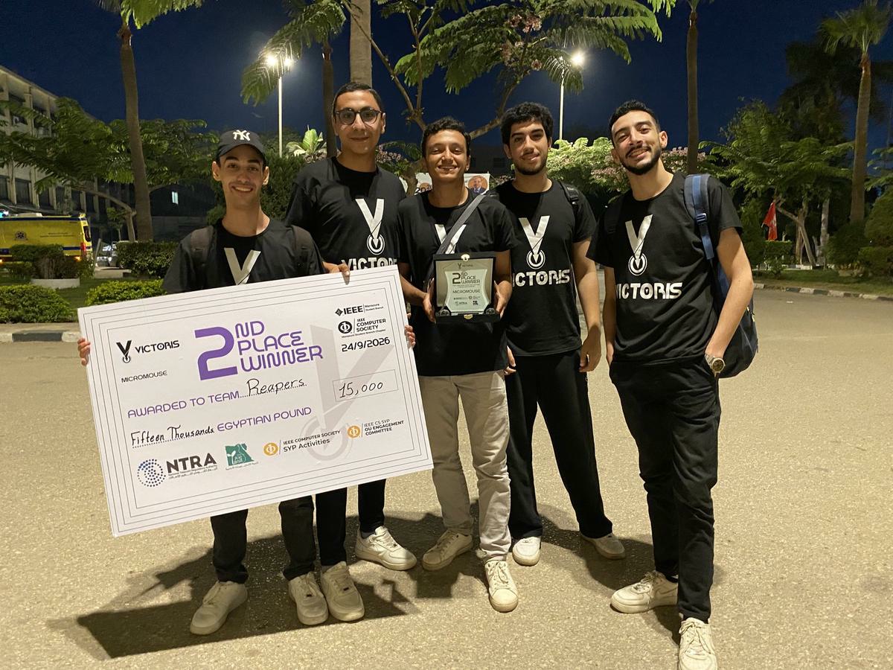
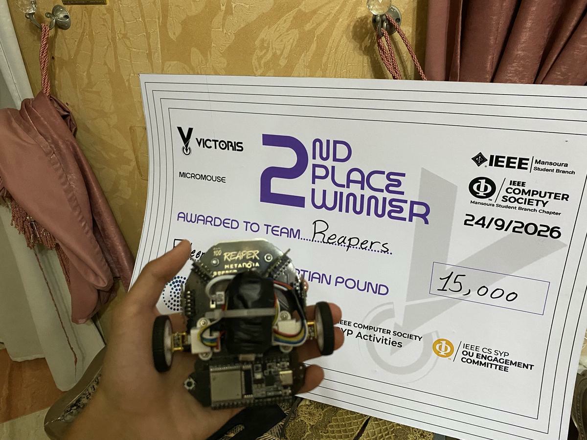

# Reapers Micromouse — IEEE Victoris 5.0

> **Second Place — Micromouse, IEEE Victoris 5.0 (24 September 2026)**



Reaper is a compact autonomous Micromouse built by **Team Reapers, Zagazig University**. It explores an unknown maze, builds a consistent wall map, reaches the four-cell center, retains confirmed map data, and executes a lower-cost speed run.

During the final round, Reaper successfully completed exploration, reached the center, and completed its speed run on the first attempt. An official run time was not available, so this repository does not report an estimated figure.

## Why this repository exists

This is an **educational engineering release**, not the complete competition firmware or a manufacturing package. It documents the architecture, design decisions, algorithms, controls, testing approach, and lessons that can help other robotics students without publishing a drop-in clone of the competition robot.

### Included

- System and firmware architecture
- Hardware overview and component rationale
- Five-sensor I²C/XSHUT strategy
- Dynamic flood-fill exploration
- Heading-aware weighted speed-run planning
- Encoder- and gyro-referenced motion concepts
- Safety and fault-handling strategy
- Simplified, hardware-agnostic examples and pseudocode

### Intentionally not included

- Complete competition firmware
- Final calibration constants and tuned gains
- Exact pin map and production-ready wiring package
- Altium sources, Gerbers, or manufacturing files
- Complete PCB routing and full schematics

## Achievement

| Item | Result |
|---|---|
| Competition | IEEE Victoris 5.0 — Micromouse |
| Organizer | IEEE Mansoura Student Branch / IEEE Computer Society Mansoura Chapter |
| Date | 24 September 2026 |
| Team | Reapers |
| Placement | **Second Place** |
| Prize | 15,000 EGP |
| Final performance | Center reached; speed run completed on the first attempt |

Official event page: https://mansoura.ieee.org/events/ieee-victoris-50

## Reaper



## System at a glance

| Subsystem | Implementation |
|---|---|
| Main controller | ESP32 |
| Range sensing | 5 × VL53L0X (front, left, right, ±45°) |
| Attitude feedback | MPU6500 gyroscope |
| Odometry | Two wheel encoders |
| Drive | Two N20 6 V / 150 RPM geared motors |
| Motor driver | TB6612FNG |
| Power | 2S LiPo, protection/BMS, regulated electronics rail |
| Exploration | Dynamic flood fill |
| Speed run | Confirmed-edge, heading-aware weighted search |
| Firmware | C++ using Arduino framework and PlatformIO |

## High-level architecture

```text
  5× VL53L0X ─┐
  MPU6500 ─────┼──> ESP32 ──> map + planning ──> motion control ──> TB6612 ──> motors
  Encoders ────┘       │                                  ▲
                       └──── safety / diagnostics ─────────┘

  2S LiPo ──> protection ──> motor rail
                         └──> regulated electronics rail
```

## Navigation strategy

### Exploration

1. Validate fresh front/left/right range evidence.
2. Classify walls with filtering and hysteresis.
3. Mirror every observed edge into the neighboring cell.
4. Recompute flood values from the four center cells.
5. Prefer the lowest flood value, with unvisited cells as a tie-breaker.
6. Update logical pose only after physical motion completes.

Unknown edges are allowed during exploration, but not during the speed run.

### Speed run

The speed planner treats state as `(x, y, heading)`, not only `(x, y)`. This allows turns to carry a cost:

```text
path cost = forward cost + 90° turn penalties + 180° turn penalties
```

Only confirmed-open edges are accepted. The recovered path is compressed into straight multi-cell segments so the robot turns once and then crosses consecutive cells.

## Firmware layers

```text
Run supervision
├── WAIT / EXPLORE / REACHED / SPEED / DONE / FAULT
├── Mapping and planning
├── Segment and cell motion
├── Wall + gyro steering
├── Encoder odometry and turn feedback
├── Sensor acquisition and validation
└── Motor output and emergency stop
```

See [`docs/`](docs/) for the engineering notes, [`firmware-excerpts/`](firmware-excerpts/) for cleaned excerpts adapted from the competition firmware, and [`examples/`](examples/) for simplified educational examples.

## Repository map

```text
.
├── README.md
├── docs/
│   ├── competition-result.md
│   ├── system-architecture.md
│   ├── hardware-overview.md
│   ├── firmware-architecture.md
│   ├── navigation-and-planning.md
│   └── motion-control-and-safety.md
├── firmware-excerpts/
│   ├── sensor_addressing_excerpt.cpp
│   ├── wall_map_excerpt.cpp
│   ├── dynamic_flood_fill_excerpt.cpp
│   └── encoder_odometry_excerpt.cpp
├── examples/
│   ├── vl53l0x_xshut_example.cpp
│   ├── flood_fill_pseudocode.cpp
│   └── heading_aware_planner_pseudocode.cpp
└── assets/
```

## Team Reapers

- **Mohamed Nasser Ibrahim** — Team Leader; embedded systems, firmware architecture, integration, motion control, and competition bring-up.
- **Mahmoud Sherif Abdelmaaz** — PCB design and electronics integration.
- **Moaz Abdelhamid Mohamed** — Mechanical design and assembly.
- **Mohamed Salah Abu El-Saud** — Mechanical design and assembly.
- **Mohamed Samir Zaki** — Mechanical design and assembly.

## Evidence boundaries

The design distinguishes between:

- features implemented in firmware,
- behavior validated in simulation,
- successful final-round behavior,
- and numerical values that would require repeatable bench measurement.

No run time, accuracy, or repeatability figure is fabricated when an official measurement is unavailable.

## Reuse and licensing

- Educational code examples: [MIT License](LICENSE-CODE)
- Documentation and original diagrams: [CC BY-NC 4.0](LICENSE-DOCS)
- Team and competition photographs remain subject to their respective owners' rights unless explicitly stated otherwise.

## Disclaimer

The examples are simplified for education. They omit robot-specific calibration, wiring details, and safety validation. Validate motor current, battery protection, emergency stopping, sensor behavior, and mechanical clearances before operating physical hardware.
